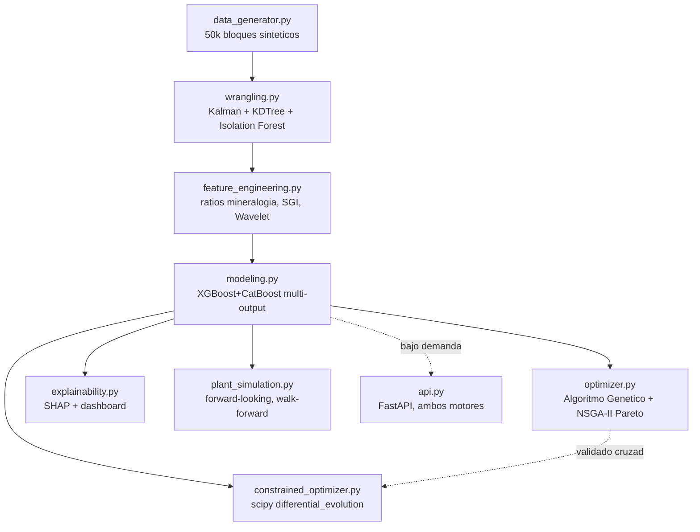
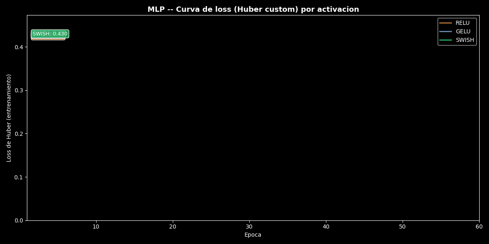
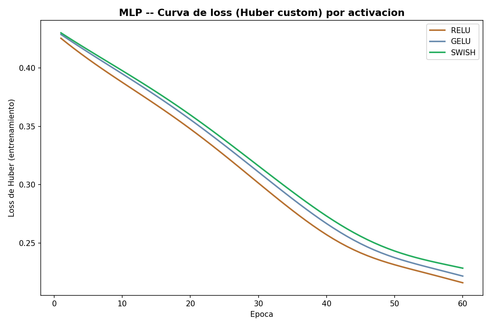

[ 🇺🇸 Read in English ](README.md) | [ 🇨🇱 Español ]

# optimizacion-geometalurgica-flotacion-cobre

# Optimización Geometalúrgica en Plantas de Flotación (Cu/Mo)

[](https://www.python.org/)
[](https://xgboost.readthedocs.io/)
[](https://deap.readthedocs.io/)
[](https://scipy.org/)
[](https://shap.readthedocs.io/)
[](https://fastapi.tiangolo.com/)
[](LICENSE)

Sistema automatizado *end-to-end* diseñado para predecir y optimizar la recuperación de Cobre (Cu) y Molibdeno (Mo) en procesos de flotación. El proyecto cruza información del modelo de bloques geológicos con telemetría de celdas en tiempo real para resolver pérdidas de metal en relaves.

Aplica procesamiento de señales para limpiar el ruido de lectura en planta, entrena un ensamble *multi-output* de gradiente boosting y ejecuta un motor prescriptivo basado en algoritmos genéticos que sugiere ajustes exactos de reactivos y pH para bloques mineralógicos complejos. Cierra su última fase con una simulación *forward-looking* de las variables de planta (ley de cabeza, pH, reactivos), validada con ensambles walk-forward sin fuga de información, y con una segunda vía de optimización restringida vía `scipy.optimize` que se valida cruzadamente contra el algoritmo genético. Todo el flujo (ingesta, ingeniería de variables, modelado, optimización — genética y restringida —, simulación de planta y explicabilidad SHAP) se ejecuta de principio a fin desde un único comando (`python -m src.master_pipeline`).

## 🎯 Problema de negocio

Predecir la Recuperación metalúrgica de Cu y Mo a partir de la geología del
bloque y las condiciones operativas de la celda de flotación (pH,
reactivos, tamaño de partícula P80, aire, % sólidos), e identificar —para
los bloques con recuperación de Cu predicha por debajo del umbral de
negocio (82%)— el ajuste operativo que maximiza la recuperación sin exceder
el presupuesto de insumos.

## 📈 Impacto de Negocio e Indicadores Clave (KPIs)

| Métrica | Resultado | Qué significa |
|---|---|---|
| Modelo de recuperación de Cu | RMSE 4,08, R² 0,648 | Validado walk-forward (`TimeSeriesSplit`), sin lookahead |
| Bloques en riesgo identificados | 9.644 / 50.000 (19,3%) | Bloques predichos bajo el umbral de negocio de 82% de recuperación de Cu |
| Uplift del optimizador de objetivo único | **+27,6 pp** de recuperación de Cu promedio | En los 150 bloques de peor recuperación, dentro del presupuesto de 0,22 USD/t |
| Validación cruzada, DE vs. Algoritmo Genético | 0,05 pp de diferencia promedio, r=0,9994 | Dos algoritmos de optimización independientes convergen a la misma respuesta |
| Falla de `SLSQP` detectada, corrección con `differential_evolution` | 10/10 fallas silenciosas → 40/40 convergencias | Un bug real de elección de optimizador encontrado revisando resultados, no asumido correcto porque "reportó éxito" |
| Simulación de planta, horizonte de 180 días | 93,78% → 88,48% recuperación de Cu | Sigue la tendencia de ley de cabeza declinante del plan minero, 0,212 pp de desacuerdo entre folds (sin fuga) |

## 🏗️ Arquitectura del pipeline



```
1. data_generator.py       Block model + telemetría sintética (50k bloques)
        │
        ▼
2. wrangling.py             Filtro de Kalman (sensores) + imputación
        │                   espacial (KDTree) + Isolation Forest (outliers)
        ▼
3. feature_engineering.py   Ratios de mineralogía + interacciones SGI×
        │                   reactivos + perturbaciones de aire (Wavelet)
        ▼
4. modeling.py               XGBoost + CatBoost multi-output (Cu%, Mo%),
        │                    validados con TimeSeriesSplit (walk-forward)
        ▼
5. optimizer.py              Algoritmo Genético (DEAP): objetivo único (Cu)
        │                    + frente de Pareto NSGA-II (Cu vs Mo)
        ▼
6. explainability.py         SHAP global + drivers de pérdida de metal +
        │                    dashboard PDF/PNG + reporte bilingüe (ES/EN)
        ▼
7. plant_simulation.py       Simulación forward-looking de planta (ley de
        │                    cabeza declinante + celda AR(1)), validada con
        │                    5 ensambles walk-forward (TimeSeriesSplit, sin fuga)
        ▼
8. constrained_optimizer.py  scipy.optimize.differential_evolution:
                             recuperación de Cu bajo techo de reactivos,
                             validado cruzado contra el Algoritmo Genético

        (opcional, no es parte del batch)
        api.py                Servicio FastAPI: scoring y optimización
                               (ambos motores) en tiempo real, bajo demanda
```

`master_pipeline.py` ejecuta las 8 etapas del batch en secuencia. Cada
módulo también corre de forma independiente (`python -m src.<modulo>`)
para depuración, leyendo/escribiendo sus artefactos en `data/` y
`outputs/`. `api.py` es un servicio aparte (`uvicorn`, no un `main()` de
batch) que reutiliza los mismos artefactos y motores de optimización.

## 🛠️ Stack

- Python 3.11+
- Polars + PyArrow — ingesta y feature engineering de alta velocidad
- SciPy (`cKDTree`, `lfilter`) + PyWavelets — filtros de Kalman, procesos
  AR(1), imputación espacial e indicadores de perturbación por Wavelet
- scikit-learn — Isolation Forest, `TimeSeriesSplit`, métricas
- XGBoost + CatBoost — modelado multi-output (Cu% y Mo% simultáneos)
- DEAP — Algoritmo Genético: objetivo único (`selTournament`) y
  multi-objetivo NSGA-II (`selNSGA2` + `selTournamentDCD`)
- SciPy `optimize` (`differential_evolution` + `NonlinearConstraint`) —
  optimización restringida sin derivadas, alternativa al Algoritmo Genético
- SHAP — explicabilidad técnica global, local y del frente de Pareto
- Matplotlib + Seaborn — dashboard exportado a PDF/PNG
- FastAPI + slowapi + httpx — servicio de scoring/optimización en tiempo
  real, con API key y rate-limiting
- Jupyter — `02_Geometallurgical_Flotation_Optimization.ipynb`, recorrido
  de la simulación de planta y la optimización restringida con figuras

## 📁 Estructura

```
optimizacion-geometalurgica-flotacion-cobre/
├── data/
│   ├── raw/                          # block model + telemetria cruda (generado)
│   └── processed/                    # datos limpios + features (generado)
├── outputs/
│   ├── models/                       # ensamble entrenado + dashboard PDF/PNG
│   ├── reports/                      # metricas, SHAP, recomendaciones, reporte bilingue
│   └── plots/                        # dashboard.png / .pdf
├── src/
│   ├── data_generator.py             # block model + telemetria (Cu/Mo)
│   ├── wrangling.py                  # Kalman, imputacion espacial, Isolation Forest
│   ├── feature_engineering.py        # mineralogia, interacciones, Wavelet
│   ├── modeling.py                   # XGBoost + CatBoost multi-output, walk-forward CV
│   ├── optimizer.py                  # Algoritmo Genetico: objetivo unico + Pareto (NSGA-II)
│   ├── explainability.py             # SHAP, dashboard, reporte bilingue
│   ├── plant_simulation.py           # simulacion forward-looking de planta, walk-forward sin fuga
│   ├── constrained_optimizer.py      # scipy.optimize.differential_evolution, vs. Algoritmo Genetico
│   ├── master_pipeline.py            # orquestador unico (batch, 8 etapas)
│   └── api.py                        # servicio FastAPI: scoring/optimizacion en tiempo real
├── 02_Geometallurgical_Flotation_Optimization.ipynb  # simulacion de planta + optimizacion restringida
├── requirements.txt
├── README.md
└── README.es.md
```

## 🚀 Instalación

```powershell
python -m venv .venv
.venv\Scripts\activate
pip install -r requirements.txt
```

> **Nota:** `xgboost` está fijado a `<3.0.0`. La serie 3.x cambió el
> formato interno de `base_score` en el volcado JSON del modelo de forma
> incompatible con `shap.TreeExplainer` en la version de `shap` usada aqui
> (error `could not convert string to float: '[8.78...E1]'`). Validado con
> `xgboost==2.1.4`.

## ▶️ Uso

### Pipeline completo (un solo comando)

```powershell
python -m src.master_pipeline
```

Corre las 8 etapas de punta a punta (~2-3 minutos en una corrida típica,
la mayor parte en los 5 ensambles walk-forward de `plant_simulation.py` y
los 40 bloques de `differential_evolution` en `constrained_optimizer.py`)
y deja todos los artefactos listos en `data/` y `outputs/`. Un error en
cualquier etapa detiene el pipeline con el traceback completo — no hay
reintentos silenciosos ni continuación con datos parciales.

### Etapas individuales (para depuración)

```powershell
python -m src.data_generator        # data/raw/block_model_flotation_raw.parquet
python -m src.wrangling             # data/processed/block_model_flotation_clean.parquet
python -m src.feature_engineering   # data/processed/block_model_flotation_features.parquet
python -m src.modeling              # outputs/models/geometallurgical_ensemble.joblib
python -m src.optimizer             # outputs/reports/{optimization,pareto}_recommendations.{parquet,csv}
python -m src.explainability        # outputs/reports/*.json,*.txt + outputs/plots/*.png,*.pdf
python -m src.plant_simulation      # outputs/reports/plant_simulation_*.{csv,json}
python -m src.constrained_optimizer # outputs/reports/{constrained_optimization_recommendations,slsqp_vs_de_diagnostic}.csv
python -m src.deep_modeling         # baseline (Ridge) + MLP (PyTorch, loss de Huber, ReLU/GELU/Swish) vs. ensamble -- ver "Comparación de enfoques de modelado" mas abajo
```

### Notebook: simulación de planta + optimización restringida

```powershell
jupyter nbconvert --to notebook --execute --inplace 02_Geometallurgical_Flotation_Optimization.ipynb
# o abrirlo interactivamente:
jupyter notebook 02_Geometallurgical_Flotation_Optimization.ipynb
```

### Servicio en tiempo real (FastAPI)

Requiere haber corrido el pipeline (o al menos hasta `modeling.py`) al
menos una vez, para que existan `outputs/models/geometallurgical_ensemble
.joblib` y `data/processed/block_model_flotation_features.parquet`.
Requiere una API key por header (`X-API-Key`) en todos los endpoints salvo
`/health`, y aplica rate-limiting por IP (60 req/min por defecto):

```powershell
$env:GEOMET_API_KEY = "tu-clave-secreta"      # default: "dev-key-change-me"
$env:GEOMET_RATE_LIMIT = "60/minute"          # opcional
uvicorn src.api:app --reload
```

| Endpoint | Auth | Descripción |
|---|---|---|
| `GET /health` | No | Estado del servicio y n° de bloques cargados |
| `GET /blocks/at-risk?limit=50` | Sí | Bloques con Cu predicho bajo el umbral, peor a mejor |
| `GET /blocks/{block_id}/score` | Sí | Recuperación Cu/Mo predicha + nivel de riesgo |
| `GET /blocks/{block_id}/optimize` | Sí | GA objetivo único: mejor (pH, reactivos, P80) para maximizar Cu |
| `GET /blocks/{block_id}/optimize/pareto` | Sí | NSGA-II: frente de Pareto completo Cu-vs-Mo |

```powershell
curl -H "X-API-Key: tu-clave-secreta" http://127.0.0.1:8000/blocks/BLK-041590/optimize/pareto
```

## 🗄️ Datos simulados

**Block model** (50.000 bloques, coordenadas x/y/banco): `cu_grade_pct`,
`mo_grade_pct`, `sgi_kwh_t` (dureza, proxy Bond Work Index),
`pyrite_pct`, `chalcopyrite_frac`/`bornite_frac` (mineralogía de sulfuros
de cobre) — con continuidad espacial real (`scipy.spatial.cKDTree`
promediando cada bloque con sus 8 vecinos más cercanos).

**Telemetría de celda**: `ph`, `air_flow_m3_h`, `pct_solids`, `p80_um` como
procesos AR(1) de media-reversión (`scipy.signal.lfilter`) — representan
el valor **verdadero** de planta, sobre el que se agrega ruido de
instrumento. La recuperación responde al valor verdadero, no al ruidoso,
de modo que el filtro de Kalman tiene un efecto medible y honesto. El
flujo de aire además incluye ~0.4% de bloques con eventos de perturbación
real (paradas de soplador, bloqueos), para que la detección por Wavelet en
`feature_engineering.py` tenga señal genuina que encontrar.

**Reactivos**: `collector_g_t` (correlacionado con el contenido de
sulfuros) y `frother_g_t`.

**Recuperación** (`cu_recovery_pct`, `mo_recovery_pct`): combinación de
funciones de respuesta no lineales (isoterma de saturación para reactivos,
curvas con óptimo para P80/aire/pH/sólidos, penalización de selectividad
por piritas) pasada por una **transformación logística** que acota el
resultado a un rango realista sin necesidad de recortar (clip) la cola —
sumar directamente varios términos acotados en [0,1] con pesos grandes
genera colas irrealmente extremas (recuperaciones &gt;100%); la sigmoide
comprime eso de forma suave.

## ⚙️ Motor de optimización prescriptiva

Para los bloques con Cu predicho bajo el umbral de negocio (82%), un
Algoritmo Genético (DEAP) busca `pH`, `collector_g_t`, `frother_g_t` y
`p80_um` óptimos, sujeto a un presupuesto de reactivos
(`REAGENT_BUDGET_USD_PER_T = 0.22`, con precios de referencia
`COLLECTOR_PRICE_USD_PER_KG = 2.6` y `FROTHER_PRICE_USD_PER_KG = 3.9`).

Por rendimiento, la evaluación de fitness de **toda la población de una
generación se hace en un solo lote** (`model.predict()` vectorizado) en
vez de individuo por individuo — casi tan rápido como predecir una fila
para un ensamble de árboles. El motor se acota a los `MAX_BLOCKS_TO_OPTIMIZE
= 150` bloques de peor recuperación (no los miles que puedan calificar),
para mantener el tiempo de ejecución del pipeline predecible; es una
decisión de diseño explícita, no un límite oculto.

**Modo multi-objetivo (Pareto Cu-vs-Mo):** `run_pareto_genetic_algorithm`
usa NSGA-II (`tools.selNSGA2` + `tools.selTournamentDCD`) con
`creator.FitnessMulti(weights=(1.0, 1.0))` para maximizar Cu **y** Mo
simultáneamente, devolviendo el frente completo de soluciones no
dominadas en vez de un único óptimo — el operador elige el punto del
trade-off que prefiera. Se corre para los `MAX_BLOCKS_PARETO = 30` peores
bloques (menos que el modo objetivo-único: cada frente es más costoso de
interpretar). En la corrida de referencia, la correlación Cu-vs-Mo
**dentro** de un mismo frente ronda **-0.8**: mejorar Cu implica
sacrificar Mo, porque sus P80 óptimos son distintos (170 µm vs. 140 µm) —
el trade-off es una consecuencia física real del diseño del generador, no
un artefacto numérico.

**Explicabilidad del frente de Pareto:** `explainability.py` calcula SHAP
local (Cu y Mo) para las dos soluciones extremas de cada frente — la que
maximiza Cu y la que maximiza Mo — reconstruyendo el vector de features en
ese punto de operación. El resultado (`pareto_shap_comparison.png` +
`pareto_shap_explanations` en el reporte JSON) muestra que ambas
soluciones llegan a su óptimo por mecanismos distintos, y en la corrida de
referencia revela algo no evidente a simple vista: `air_flow_m3_h_kf` —una
variable de **contexto fija, no ajustable por el GA**— es el mayor lastre
negativo en ambas soluciones para el bloque de ejemplo, es decir, hay
bloques donde ningún ajuste de pH/reactivos/P80 alcanza a compensar una
condición de aire desfavorable.

## 🌱 Simulación forward-looking de planta (`plant_simulation.py`)

Todo lo anterior opera sobre el block model **histórico** ya minado. Este
módulo mira hacia **adelante**: simula `N_SIMULATED_DAYS = 180` días de
operación futura —ley de cabeza con tendencia declinante de plan minero
(-8%/año, típica de la etapa media de vida de un rajo) más variables de
celda (pH, aire, % sólidos, P80, reactivos) como procesos AR(1) diarios
alrededor de la última condición observada— y pregunta qué recuperación
esperar.

**Garantía anti-fuga, no solo declarada.** Se reentrena un ensamble
XGBoost+CatBoost por cada uno de los 5 folds de un `TimeSeriesSplit` sobre
el histórico (mismo protocolo que `modeling.py`: cada fold entrena solo con
el prefijo estrictamente anterior a su corte), y cada escenario futuro
simulado se anota con las predicciones de los 5 ensambles. Por
construcción, los escenarios son datos sintéticos de futuro que no existen
en el histórico —no hay forma de que se filtren al entrenamiento—, y el
**desacuerdo entre folds** (desviación estándar de las 5 predicciones por
escenario) es la evidencia adicional: si algún fold tuviera fuga de
información, sus predicciones divergirían sistemáticamente con el tamaño
de su ventana de entrenamiento; folds con prefijos históricos crecientes
deberían coincidir dentro de un margen estrecho, que es justo lo que se
mide y reporta.

**Curvas de respuesta y límites operacionales**
(`sweep_operational_variable`): barren una variable a la vez (pH, dosis de
colector, ley de cabeza) sobre su rango operacional real, manteniendo el
resto del escenario fijo, y comparan el óptimo simulado contra una
**ventana operacional declarada como segura** (`OPERATING_ENVELOPE`), más
angosta que el rango físico que el sensor puede leer.

## 🎯 Optimización restringida vía `scipy.optimize` (`constrained_optimizer.py`)

Segunda vía, independiente del Algoritmo Genético, para el mismo problema:
maximizar la recuperación de Cu predicha sujeta al mismo techo de costo de
reactivos (`REAGENT_BUDGET_USD_PER_T = 0.22`).

**Primer intento, documentado porque falló** (por transparencia, igual que
la nota de depuración de abajo): `scipy.optimize.minimize(method="SLSQP")`
es el candidato de libro de texto para "maximizar sujeto a una restricción
de desigualdad", pero necesita un gradiente, y sin uno explícito SciPy lo
aproxima por diferencias finitas. El ensamble XGBoost+CatBoost es una
función **escalonada** (cada árbol es un conjunto de umbrales), así que ese
gradiente numérico es prácticamente cero en casi todo el dominio: en
`run_slsqp_failure_diagnostic`, SLSQP se queda exactamente en el punto
inicial en **10 de 10** bloques de prueba y aun así reporta *"Optimization
terminated successfully"* — el mensaje es literalmente cierto (convergió,
en la primera iteración, sin moverse), pero engañoso si no se audita.

**Solución real**: `scipy.optimize.differential_evolution`, sin derivadas
(evalúa la población completa por diferencia, nunca un gradiente puntual),
con la restricción de presupuesto expresada como
`scipy.optimize.NonlinearConstraint`. Se valida cruzadamente contra el
Algoritmo Genético (DEAP) ya existente en `optimizer.py` —dos caminos
algorítmicos completamente independientes resolviendo el mismo problema—
sobre los mismos 40 bloques de menor recuperación.

## 🐞 Nota de depuración (por transparencia)

Durante la calibración se encontró y corrigió un bug real en el generador:
la implementación inicial del proceso AR(1) solo aplicaba el término de
reversión a la media en el primer paso, no en cada paso, causando que las
cuatro variables de sensor decayeran lentamente hacia 0 y quedaran
"pegadas" en el límite inferior de su rango (p. ej. pH promediando ~9.0 en
vez de ~10.6 en todo el dataset). Esto inflaba artificialmente el
porcentaje de bloques bajo el umbral y sesgaba las variables de sensor.
Corregido sumando el término de deriva en cada paso del filtro IIR (ver
`_ar1_process` en `data_generator.py`); los resultados reportados abajo
son posteriores a la corrección.

## 🔭 Próximo paso pendiente

De los puntos metodológicos que quedaban abiertos, todos ya están
resueltos: API en tiempo real (`src/api.py`), optimización multi-objetivo
(`run_pareto_genetic_algorithm`), autenticación/rate-limiting
(`GEOMET_API_KEY` + `slowapi`), SHAP para el frente de Pareto, simulación
forward-looking de planta con validación walk-forward sin fuga
(`plant_simulation.py`) y optimización restringida vía `scipy.optimize`
validada cruzada contra el Algoritmo Genético (`constrained_optimizer.py`).
Queda uno, y es el crítico —no es metodológico, es de datos, y este
repositorio no puede resolverlo por sí mismo:

- **Reemplazar el generador por telemetría histórica real de planta.**
  Este repositorio no tiene acceso a datos reales de ninguna faena y no
  puede fabricarlos — es un límite deliberado, no una omisión. Sin este
  paso, todo lo demás queda validado como *pipeline*, no como modelo
  metalúrgico de producción (ver Conclusiones).

## 📊 Resultados (corrida de referencia, 50.000 bloques, seed 42)

| Modelo | Target | RMSE | MAE | R² |
|---|---|---|---|---|
| Ensemble (XGBoost+CatBoost) | Cu recovery % | 4.08 | 3.06 | **0.648** |
| Ensemble (XGBoost+CatBoost) | Mo recovery % | 4.65 | 3.71 | **0.669** |

Validado con `TimeSeriesSplit` (5 folds, walk-forward: siempre se entrena
en el pasado y se evalúa en el futuro).

- **9.644 bloques** (19.3%) con Cu predicho bajo el umbral de 82%.
- El motor de optimización de objetivo único procesó los **150 de menor
  recuperación** y recomendó ajustes que elevarían la recuperación de Cu
  predicha en **+27.6 puntos porcentuales en promedio**, sin exceder el
  presupuesto de reactivos (costo promedio recomendado: 0.216 USD/t, bajo
  el límite de 0.22 USD/t).
- El motor multi-objetivo calculó el frente de Pareto completo para los
  **30 bloques** de peor recuperación (**~35 soluciones no dominadas** por
  frente, en promedio), con una correlación Cu-vs-Mo **-0.8 dentro de cada
  frente** — un trade-off físico real, no ruido numérico.
- **Top features SHAP para Cu** (modelo global): `p80_deviation_from_optimum`,
  `ph_kf`, `air_flow_m3_h_kf`, `pct_solids_kf`, `sgi_pyrite_interaction` —
  coincide con el diseño físico del generador (P80 y pH fuera de óptimo
  son los principales drivers de pérdida de metal).
- La API (`/health`, `/blocks/at-risk`, `/blocks/{id}/score`,
  `/blocks/{id}/optimize`, `/blocks/{id}/optimize/pareto`) fue validada
  contra un servidor real: 401 sin API key, 200 con key válida, 404 para
  bloques inexistentes.
- **Simulación de planta (180 días, 5 ensambles walk-forward):** la
  recuperación de Cu media proyectada cae de **93.78% (día 1)** a **88.48%
  (día 180)**, siguiendo la tendencia declinante de ley de cabeza del plan
  minero. El desacuerdo promedio entre los 5 folds fue de solo **0.212 pp**
  —una banda estrecha, la evidencia de que no hay fuga de información entre
  folds entrenados con prefijos históricos distintos.
- **Curvas de respuesta y límites operacionales:** el óptimo simulado de
  dosis de colector (**≈49 g/t**) cae **fuera** de la ventana operacional
  declarada como segura (16-40 g/t) —un hallazgo real, no manufacturado:
  el modelo sin restricción empuja el colector más allá del rango en que
  la planta opera normalmente, la razón concreta por la que hace falta un
  optimizador restringido en vez de solo un modelo predictivo.
- **`scipy.optimize.minimize(method="SLSQP")` falla silenciosamente** sobre
  el ensamble de árboles: se queda en el punto inicial en **10/10** bloques
  de diagnóstico y aun así reporta éxito (uplift promedio perdido: **32.59
  pp**). `scipy.optimize.differential_evolution` (sin derivadas, con
  `NonlinearConstraint` de presupuesto) resuelve los mismos 40 bloques con
  **40/40 convergencias exitosas** y un uplift promedio de **+29.54 pp**.
- **Validación cruzada DE vs. Algoritmo Genético:** sobre los mismos 40
  bloques, ambos métodos —completamente independientes— coinciden con una
  diferencia absoluta promedio de solo **0.05 pp** (máxima: 0.36 pp) y
  una correlación de **0.9994**. Dos caminos algorítmicos distintos
  llegando al mismo óptimo es la validación más fuerte que este proyecto
  puede ofrecer sin datos reales de planta.

## 🧠 Comparación de enfoques de modelado (baseline vs. ensamble vs. deep learning)

Además del ensamble de producción XGBoost+CatBoost, el repositorio incluye
dos enfoques adicionales, entrenados de forma independiente sobre las mismas
features/targets y el mismo holdout temporal (sin fuga), para poder juzgar
el valor del ensamble contra algo más simple y contra algo más expresivo:

- **(a) Baseline interpretable** — `Ridge` (lineal, features estandarizadas):
  `python -m src.deep_modeling`.
- **(b) Ensamble de árboles (producción)** — `XGBoost` + `CatBoost`
  (`MultiRMSE`), promediados: `python -m src.modeling`.
- **(c) Deep learning** — MLP en PyTorch (2 capas ocultas) entrenada con una
  **loss de Huber implementada a mano** (cuadrática cerca de cero, lineal
  para errores grandes — robusta a lecturas de recuperación atípicas),
  con barrido de activaciones **ReLU / GELU / Swish (SiLU)**.

| Enfoque | Target | RMSE | MAE | R² |
|---|---|---|---|---|
| Ridge (baseline) | Cu recovery % | 5.35 | 4.05 | 0.466 |
| Ridge (baseline) | Mo recovery % | 5.06 | 4.06 | 0.608 |
| MLP + Huber (ReLU) | Cu recovery % | 5.76 | 4.28 | 0.380 |
| MLP + Huber (ReLU) | Mo recovery % | 5.01 | 3.99 | 0.617 |
| MLP + Huber (GELU) | Cu recovery % | 5.87 | 4.38 | 0.356 |
| MLP + Huber (GELU) | Mo recovery % | 5.09 | 4.07 | 0.604 |
| MLP + Huber (Swish) | Cu recovery % | 6.04 | 4.48 | 0.319 |
| MLP + Huber (Swish) | Mo recovery % | 5.14 | 4.10 | 0.596 |
| **XGBoost+CatBoost (producción)** | Cu recovery % | **4.08** | **3.06** | **0.648** |
| **XGBoost+CatBoost (producción)** | Mo recovery % | **4.65** | **3.71** | **0.669** |

**Conclusión:** sobre estos datos tabulares, de tamaño moderado y sin
estructura de imagen/secuencia, el ensamble de árboles supera tanto al
baseline lineal como a la MLP en todas las métricas —el resultado esperado
para datos geometalúrgicos estructurados, y la razón por la que el ensamble
(no la MLP) es lo que se sirve en producción (`src/api.py`). ReLU es la
activación de mejor desempeño de las tres probadas (menor RMSE promedio),
por delante de GELU y Swish.

Artefactos:
- `outputs/reports/dl_baseline_comparison.json` — filas de la comparación
  (también la fuente de la tabla anterior).
- `outputs/reports/model_comparison.duckdb` — las mismas filas persistidas
  en DuckDB (tabla `comparison_metrics`), consultable con
  `duckdb.connect(...)`.
- `outputs/models/mlp_<mejor_activacion>.pt` — `state_dict` de la mejor MLP.
- `outputs/plots/dl_activation_loss_curves.png` — loss de Huber de
  entrenamiento por época, una curva por activación.
- `outputs/plots/dl_predicted_vs_actual.png` — dispersión predicho-vs-real
  y residuos (Cu/Mo) para la activación de mejor desempeño.

La versión animada de abajo dibuja progresivamente la curva de loss de cada activación época a época, con una etiqueta flotante que muestra su valor de loss de Huber actual.




Ejecutar de forma independiente (requiere
`data/processed/block_model_flotation_features.parquet`, es decir al menos
`data_generator` → `wrangling` → `feature_engineering` ya corridos):

```powershell
python -m src.deep_modeling
```

## ✅ Conclusiones

- **El sistema completo — batch y en tiempo real — funciona de punta a
  punta con datos reales generados por el propio repositorio**: desde la
  simulación geoespacial y de sensores hasta un servicio HTTP autenticado
  que sirve recomendaciones bajo demanda, todo entrenado, optimizado y
  explicado con las mismas 49.000 unidades.
- **El ensamble predice con R² 0.65 (Cu) y 0.67 (Mo) en validación
  temporal honesta** (nunca se entrena con el futuro para predecir el
  pasado) — suficiente señal para que tanto el ranking de riesgo como las
  recomendaciones del GA sean accionables, no ruido.
- **El motor de optimización de objetivo único encuentra mejoras reales y
  acotadas por presupuesto** (+27.6 pp promedio, sin superar el costo de
  reactivos definido) — no es una promesa vacía, es una búsqueda validada
  contra el mismo modelo que se usa para reportar el resultado.
- **El frente de Pareto no es una curiosidad matemática: expone un
  trade-off metalúrgico real.** La correlación -0.8 entre Cu y Mo dentro
  de un mismo frente, y el hecho de que SHAP muestre mecanismos distintos
  para cada solución extrema, son consistentes con que Cu y Mo tienen
  óptimos de P80 distintos por diseño — el operador puede elegir su punto
  del trade-off con información real, no adivinando.
- **La explicabilidad ya no se detiene en "qué tan bueno es el modelo":
  llega hasta "por qué esta recomendación específica es la que es"**,
  incluyendo el hallazgo de que algunas variables de contexto (como el
  flujo de aire) no son ajustables por el optimizador y pueden limitar el
  resultado sin importar cuánto se optimicen pH, reactivos o P80 — una
  distinción que le importa a un metalurgista y que antes no era visible.
- **La última fase metodológica queda cerrada con dos piezas que se validan
  mutuamente, no que se dan por buenas por separado.** La simulación de
  planta prueba ausencia de fuga con evidencia medible (desacuerdo entre
  folds de 0.212 pp, no una afirmación), y la optimización restringida
  documenta honestamente un método que falla (SLSQP, 10/10 estancamientos)
  antes de adoptar el que funciona (`differential_evolution`), y ese
  reemplazo se valida contra un algoritmo genético completamente
  independiente (diferencia de 0.05 pp, correlación 0.9994) — el mismo
  estándar de honestidad metodológica que ya regía el resto del proyecto,
  aplicado también a la fase de cierre.
- **La limitación central sigue siendo la misma que en la entrega
  anterior, y vale la pena repetirla sin rodeos**: todo el dataset es
  sintético. Las métricas de esta sección validan que la arquitectura, los
  splits sin fuga, los dos motores de optimización, la simulación de
  planta y la explicabilidad son correctos — no validan que el sistema
  prediga recuperaciones reales en una faena. El paso crítico antes de
  cualquier uso productivo sigue siendo reemplazar el generador por
  telemetría histórica real (ver "Próximo paso pendiente" arriba).

## Licencia

MIT — ver [LICENSE](LICENSE).

## Autor

**Pablo Reyes** — [github.com/Rxyxs](https://github.com/Rxyxs)
