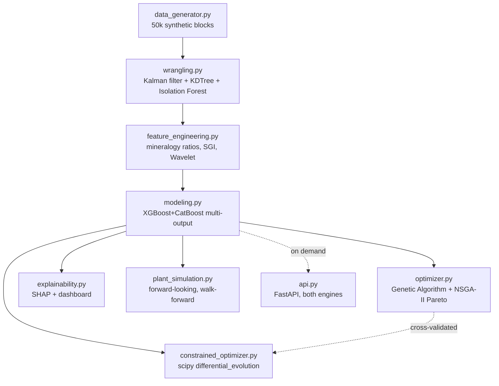

[ 🇺🇸 English ] | [ 🇨🇱 Leer en Español ](README.es.md)

# optimizacion-geometalurgica-flotacion-cobre

# Geometallurgical Optimization for Copper Flotation Plants (Cu/Mo)

[](https://www.python.org/)
[](https://xgboost.readthedocs.io/)
[](https://deap.readthedocs.io/)
[](https://scipy.org/)
[](https://shap.readthedocs.io/)
[](https://fastapi.tiangolo.com/)
[](LICENSE)

Automated *end-to-end* system designed to predict and optimize Copper (Cu) and Molybdenum (Mo) recovery in flotation processes. The project combines geological block-model data with real-time cell telemetry to address metal losses in tailings.

It applies signal processing to clean plant sensor noise, trains a *multi-output* gradient-boosting ensemble, and runs a prescriptive engine based on genetic algorithms that recommends exact reagent and pH adjustments for complex mineralogical blocks. It closes its final phase with a *forward-looking* simulation of plant operating variables (head grade, pH, reagents), validated with leak-free walk-forward ensembles, plus a second, independent constrained-optimization path via `scipy.optimize` that is cross-validated against the genetic algorithm. The full flow (ingestion, feature engineering, modeling, optimization — genetic and constrained —, plant simulation, and SHAP explainability) runs end to end from a single command (`python -m src.master_pipeline`).

## 🎯 Business problem

Predict Cu and Mo metallurgical recovery from the block's geology and the
flotation cell's operating conditions (pH, reagents, P80 particle size,
air, % solids), and identify — for blocks with predicted Cu recovery below
the business threshold (82%) — the operational adjustment that maximizes
recovery without exceeding the reagent budget.

## 📈 Business Impact & Key Performance Indicators

| Metric | Result | What it means |
|---|---|---|
| Cu recovery model | RMSE 4.08, R² 0.648 | Walk-forward validated (`TimeSeriesSplit`), no lookahead |
| At-risk blocks identified | 9,644 / 50,000 (19.3%) | Blocks predicted below the 82% Cu recovery business threshold |
| Single-objective optimizer uplift | **+27.6 pp** average Cu recovery | On the 150 worst-recovery blocks, within the 0.22 USD/t reagent budget |
| Cross-validation, DE vs. Genetic Algorithm | 0.05 pp avg. difference, r=0.9994 | Two independent optimization algorithms converge to the same answer |
| `SLSQP` failure caught, `differential_evolution` fix | 10/10 silent failures → 40/40 convergences | A real optimizer-choice bug found by checking results, not assumed to work because it "reported success" |
| Plant simulation, 180-day horizon | 93.78% → 88.48% Cu recovery | Tracks the declining head-grade mine plan, 0.212 pp inter-fold disagreement (leak-free) |

## 🏗️ Pipeline architecture



```
1. data_generator.py       Synthetic block model + cell telemetry (50k blocks)
        │
        ▼
2. wrangling.py             Kalman filter (sensors) + spatial imputation
        │                   (KDTree) + Isolation Forest (outliers)
        ▼
3. feature_engineering.py   Mineralogy ratios + SGI × reagent interactions
        │                   + air-flow perturbations (Wavelet)
        ▼
4. modeling.py               XGBoost + CatBoost multi-output (Cu%, Mo%),
        │                    validated with TimeSeriesSplit (walk-forward)
        ▼
5. optimizer.py              Genetic Algorithm (DEAP): single objective (Cu)
        │                    + NSGA-II Pareto front (Cu vs Mo)
        ▼
6. explainability.py         Global SHAP + metal-loss drivers +
        │                    PDF/PNG dashboard + bilingual report (ES/EN)
        ▼
7. plant_simulation.py       Forward-looking plant simulation (declining
        │                    head grade + AR(1) cell variables), validated
        │                    with 5 walk-forward ensembles (TimeSeriesSplit, leak-free)
        ▼
8. constrained_optimizer.py  scipy.optimize.differential_evolution:
                             Cu recovery under a reagent-cost ceiling,
                             cross-validated against the Genetic Algorithm

        (optional, not part of the batch)
        api.py                FastAPI service: scoring and optimization
                               (both engines) in real time, on demand
```

`master_pipeline.py` runs all 8 batch stages in sequence. Each module can
also run independently (`python -m src.<module>`) for debugging, reading
and writing its artifacts to `data/` and `outputs/`. `api.py` is a
separate service (`uvicorn`, not a batch `main()`) that reuses the same
artifacts and optimization engines.

## 🛠️ Stack

- Python 3.11+
- Polars + PyArrow — high-speed ingestion and feature engineering
- SciPy (`cKDTree`, `lfilter`) + PyWavelets — Kalman filters, AR(1)
  processes, spatial imputation, and Wavelet perturbation indicators
- scikit-learn — Isolation Forest, `TimeSeriesSplit`, metrics
- XGBoost + CatBoost — multi-output modeling (Cu% and Mo% simultaneously)
- DEAP — Genetic Algorithm: single objective (`selTournament`) and
  multi-objective NSGA-II (`selNSGA2` + `selTournamentDCD`)
- SciPy `optimize` (`differential_evolution` + `NonlinearConstraint`) —
  derivative-free constrained optimization, an alternative to the GA
- SHAP — global, local, and Pareto-front technical explainability
- Matplotlib + Seaborn — dashboard exported to PDF/PNG
- FastAPI + slowapi + httpx — real-time scoring/optimization service,
  with API key and rate-limiting
- Jupyter — `02_Geometallurgical_Flotation_Optimization.ipynb`, a
  walkthrough of the plant simulation and constrained optimization with figures

## 📁 Structure

```
optimizacion-geometalurgica-flotacion-cobre/
├── data/
│   ├── raw/                          # raw block model + telemetry (generated)
│   └── processed/                    # cleaned data + features (generated)
├── outputs/
│   ├── models/                       # trained ensemble + PDF/PNG dashboard
│   ├── reports/                      # metrics, SHAP, recommendations, bilingual report
│   └── plots/                        # dashboard.png / .pdf
├── src/
│   ├── data_generator.py             # block model + telemetry (Cu/Mo)
│   ├── wrangling.py                  # Kalman, spatial imputation, Isolation Forest
│   ├── feature_engineering.py        # mineralogy, interactions, Wavelet
│   ├── modeling.py                   # XGBoost + CatBoost multi-output, walk-forward CV
│   ├── optimizer.py                  # Genetic Algorithm: single objective + Pareto (NSGA-II)
│   ├── explainability.py             # SHAP, dashboard, bilingual report
│   ├── plant_simulation.py           # forward-looking plant simulation, leak-free walk-forward
│   ├── constrained_optimizer.py      # scipy.optimize.differential_evolution, vs. Genetic Algorithm
│   ├── master_pipeline.py            # single orchestrator (batch, 8 stages)
│   └── api.py                        # FastAPI service: real-time scoring/optimization
├── 02_Geometallurgical_Flotation_Optimization.ipynb  # plant simulation + constrained optimization
├── requirements.txt
├── README.md
└── README.es.md
```

## 🚀 Installation

```powershell
python -m venv .venv
.venv\Scripts\activate
pip install -r requirements.txt
```

> **Note:** `xgboost` is pinned to `<3.0.0`. The 3.x series changed the
> internal `base_score` format in the model's JSON dump in a way that is
> incompatible with `shap.TreeExplainer` in the `shap` version used here
> (error `could not convert string to float: '[8.78...E1]'`). Validated
> with `xgboost==2.1.4`.

## ▶️ Usage

### Full pipeline (single command)

```powershell
python -m src.master_pipeline
```

Runs all 8 stages end to end (~2-3 minutes in a typical run, most of it
spent on the 5 walk-forward ensembles in `plant_simulation.py` and the 40
blocks of `differential_evolution` in `constrained_optimizer.py`) and
leaves every artifact ready in `data/` and `outputs/`. An error in any
stage stops the pipeline with the full traceback — no silent retries and
no continuing with partial data.

### Individual stages (for debugging)

```powershell
python -m src.data_generator        # data/raw/block_model_flotation_raw.parquet
python -m src.wrangling             # data/processed/block_model_flotation_clean.parquet
python -m src.feature_engineering   # data/processed/block_model_flotation_features.parquet
python -m src.modeling              # outputs/models/geometallurgical_ensemble.joblib
python -m src.optimizer             # outputs/reports/{optimization,pareto}_recommendations.{parquet,csv}
python -m src.explainability        # outputs/reports/*.json,*.txt + outputs/plots/*.png,*.pdf
python -m src.plant_simulation      # outputs/reports/plant_simulation_*.{csv,json}
python -m src.constrained_optimizer # outputs/reports/{constrained_optimization_recommendations,slsqp_vs_de_diagnostic}.csv
```

### Notebook: plant simulation + constrained optimization

```powershell
jupyter nbconvert --to notebook --execute --inplace 02_Geometallurgical_Flotation_Optimization.ipynb
# or open it interactively:
jupyter notebook 02_Geometallurgical_Flotation_Optimization.ipynb
```

### Real-time service (FastAPI)

Requires having run the pipeline (or at least through `modeling.py`) at
least once, so that `outputs/models/geometallurgical_ensemble.joblib` and
`data/processed/block_model_flotation_features.parquet` exist. Requires an
API key via header (`X-API-Key`) on every endpoint except `/health`, and
applies per-IP rate-limiting (60 req/min by default):

```powershell
$env:GEOMET_API_KEY = "your-secret-key"       # default: "dev-key-change-me"
$env:GEOMET_RATE_LIMIT = "60/minute"          # optional
uvicorn src.api:app --reload
```

| Endpoint | Auth | Description |
|---|---|---|
| `GET /health` | No | Service status and number of loaded blocks |
| `GET /blocks/at-risk?limit=50` | Yes | Blocks with Cu predicted below threshold, worst to best |
| `GET /blocks/{block_id}/score` | Yes | Predicted Cu/Mo recovery + risk level |
| `GET /blocks/{block_id}/optimize` | Yes | Single-objective GA: best (pH, reagents, P80) to maximize Cu |
| `GET /blocks/{block_id}/optimize/pareto` | Yes | NSGA-II: full Cu-vs-Mo Pareto front |

```powershell
curl -H "X-API-Key: your-secret-key" http://127.0.0.1:8000/blocks/BLK-041590/optimize/pareto
```

## 🗄️ Simulated data

**Block model** (50,000 blocks, x/y/bench coordinates): `cu_grade_pct`,
`mo_grade_pct`, `sgi_kwh_t` (hardness, a Bond Work Index proxy),
`pyrite_pct`, `chalcopyrite_frac`/`bornite_frac` (copper-sulfide
mineralogy) — with real spatial continuity (`scipy.spatial.cKDTree`
averaging each block with its 8 nearest neighbors).

**Cell telemetry**: `ph`, `air_flow_m3_h`, `pct_solids`, `p80_um` as
mean-reverting AR(1) processes (`scipy.signal.lfilter`) — representing the
**true** plant value, on top of which instrument noise is added. Recovery
responds to the true value, not the noisy one, so the Kalman filter has a
measurable, honest effect. Air flow additionally includes ~0.4% of blocks
with real perturbation events (blower stoppages, line blockages), so that
Wavelet detection in `feature_engineering.py` has genuine signal to find.

**Reagents**: `collector_g_t` (correlated with sulfide content) and
`frother_g_t`.

**Recovery** (`cu_recovery_pct`, `mo_recovery_pct`): a combination of
non-linear response functions (saturating isotherm for reagents,
optimum-shaped curves for P80/air/pH/solids, pyrite selectivity penalty)
passed through a **logistic transform** that bounds the result to a
realistic range without aggressive tail clipping — directly summing
several [0,1]-bounded terms with large weights produces unrealistically
extreme tails (recoveries &gt;100%); the sigmoid compresses that smoothly.

## ⚙️ Prescriptive optimization engine

For blocks with predicted Cu below the business threshold (82%), a
Genetic Algorithm (DEAP) searches for optimal `pH`, `collector_g_t`,
`frother_g_t`, and `p80_um`, subject to a reagent budget
(`REAGENT_BUDGET_USD_PER_T = 0.22`, with reference prices
`COLLECTOR_PRICE_USD_PER_KG = 2.6` and `FROTHER_PRICE_USD_PER_KG = 3.9`).

For performance, fitness evaluation for **an entire generation's
population is done in a single batch** (vectorized `model.predict()`)
instead of individual by individual — almost as fast as predicting one row
for a tree ensemble. The engine is capped at the `MAX_BLOCKS_TO_OPTIMIZE =
150` worst-recovery blocks (not the thousands that may qualify), to keep
pipeline runtime predictable; this is an explicit design decision, not a
hidden limit.

**Multi-objective mode (Cu-vs-Mo Pareto):** `run_pareto_genetic_algorithm`
uses NSGA-II (`tools.selNSGA2` + `tools.selTournamentDCD`) with
`creator.FitnessMulti(weights=(1.0, 1.0))` to maximize Cu **and** Mo
simultaneously, returning the full front of non-dominated solutions
instead of a single optimum — the operator picks the trade-off point they
prefer. It runs for the `MAX_BLOCKS_PARETO = 30` worst blocks (fewer than
the single-objective mode: each front is more expensive to interpret). In
the reference run, the Cu-vs-Mo correlation **within** a given front is
around **-0.8**: improving Cu means sacrificing Mo, because their optimal
P80 values differ (170 µm vs. 140 µm) — the trade-off is a real physical
consequence of the generator's design, not a numerical artifact.

**Pareto-front explainability:** `explainability.py` computes local SHAP
(Cu and Mo) for each front's two extreme solutions — the one that
maximizes Cu and the one that maximizes Mo — reconstructing the feature
vector at that operating point. The result (`pareto_shap_comparison.png` +
`pareto_shap_explanations` in the JSON report) shows that both solutions
reach their optimum through different mechanisms, and in the reference run
reveals something not obvious at a glance: `air_flow_m3_h_kf` — a
**fixed context variable, not adjustable by the GA** — is the largest
negative drag in both solutions for the example block, i.e., there are
blocks where no adjustment of pH/reagents/P80 can compensate for
unfavorable air conditions.

## 🌱 Forward-looking plant simulation (`plant_simulation.py`)

Everything above operates on the **historical**, already-mined block
model. This module looks **forward**: it simulates `N_SIMULATED_DAYS =
180` days of future operation — head grade with a declining mine-plan
trend (-8%/year, typical of the mid-life stage of an open pit) plus cell
variables (pH, air, % solids, P80, reagents) as daily AR(1) processes
around the last observed condition — and asks what recovery to expect.

**Leak-free guarantee, not just a claim.** An XGBoost+CatBoost ensemble is
retrained for each of the 5 folds of a `TimeSeriesSplit` over the
historical data (same protocol as `modeling.py`: each fold trains only on
the prefix strictly before its cutoff), and every simulated future
scenario is annotated with all 5 ensembles' predictions. By construction,
the scenarios are synthetic future data that don't exist in the
historical set — there is no way for them to leak into training — and the
**inter-fold disagreement** (standard deviation of the 5 predictions per
scenario) is the additional evidence: if any fold had information leakage,
its predictions would diverge systematically with training-window size;
folds with growing historical prefixes should instead agree within a
narrow margin, which is exactly what is measured and reported.

**Response curves and operational limits**
(`sweep_operational_variable`): sweep one variable at a time (pH,
collector dose, head grade) over its real operating range, holding the
rest of the scenario fixed, and compare the simulated optimum against a
**declared safe operating envelope** (`OPERATING_ENVELOPE`), narrower than
the physical range the sensor can read.

## 🎯 Constrained optimization via `scipy.optimize` (`constrained_optimizer.py`)

A second, independent path to the same problem: maximize predicted Cu
recovery subject to the same reagent-cost ceiling
(`REAGENT_BUDGET_USD_PER_T = 0.22`).

**First attempt, documented because it failed** (in the same spirit of
transparency as the debugging note below): `scipy.optimize.minimize` with
`method="SLSQP"` is the textbook candidate for "maximize subject to an
inequality constraint," but it needs a gradient, and without one
explicitly supplied SciPy approximates it by finite differences. The
XGBoost+CatBoost ensemble is a **step function** (every tree is a set of
thresholds), so that numerical gradient is essentially zero almost
everywhere in the domain: in `run_slsqp_failure_diagnostic`, SLSQP gets
stuck exactly at the initial point in **10 out of 10** test blocks and
still reports *"Optimization terminated successfully"* — the message is
literally true (it converged, on the first iteration, without moving),
but misleading unless audited.

**The real solution**: `scipy.optimize.differential_evolution`,
derivative-free (it evaluates the entire population by difference, never
a pointwise gradient), with the budget constraint expressed as a
`scipy.optimize.NonlinearConstraint`. It is cross-validated against the
Genetic Algorithm (DEAP) already present in `optimizer.py` — two
completely independent algorithmic paths solving the same problem — on
the same 40 worst-recovery blocks.

## 🐞 Debugging note (for transparency)

During calibration, a real bug was found and fixed in the generator: the
initial AR(1) process implementation only applied the mean-reversion term
on the first step, not on every step, causing the four sensor variables to
slowly decay toward 0 and get "stuck" at the lower bound of their range
(e.g., pH averaging ~9.0 instead of ~10.6 across the dataset). This
artificially inflated the percentage of below-threshold blocks and biased
the sensor variables. Fixed by adding the drift term at every step of the
IIR filter (see `_ar1_process` in `data_generator.py`); the results
reported below are from after the fix.

## 🔭 Remaining next step

Of the methodological items that were still open, all are now resolved:
real-time API (`src/api.py`), multi-objective optimization
(`run_pareto_genetic_algorithm`), authentication/rate-limiting
(`GEOMET_API_KEY` + `slowapi`), SHAP for the Pareto front, forward-looking
plant simulation with leak-free walk-forward validation
(`plant_simulation.py`), and constrained optimization via `scipy.optimize`
cross-validated against the Genetic Algorithm (`constrained_optimizer.py`).
One remains, and it's the critical one — not methodological, but a data
one, and this repository cannot resolve it on its own:

- **Replace the generator with real historical plant telemetry.** This
  repository has no access to real data from any mine site and cannot
  fabricate it — this is a deliberate limit, not an oversight. Without
  this step, everything else is validated as a *pipeline*, not as a
  production metallurgical model (see Conclusions).

## 📊 Results (reference run, 50,000 blocks, seed 42)

| Model | Target | RMSE | MAE | R² |
|---|---|---|---|---|
| Ensemble (XGBoost+CatBoost) | Cu recovery % | 4.08 | 3.06 | **0.648** |
| Ensemble (XGBoost+CatBoost) | Mo recovery % | 4.65 | 3.71 | **0.669** |

Validated with `TimeSeriesSplit` (5 folds, walk-forward: always trains on
the past and evaluates on the future).

- **9,644 blocks** (19.3%) with predicted Cu below the 82% threshold.
- The single-objective optimization engine processed the **150
  worst-recovery blocks** and recommended adjustments that would raise
  predicted Cu recovery by **+27.6 percentage points on average**, without
  exceeding the reagent budget (average recommended cost: 0.216 USD/t,
  under the 0.22 USD/t limit).
- The multi-objective engine computed the full Pareto front for the **30
  worst-recovery blocks** (**~35 non-dominated solutions** per front on
  average), with a Cu-vs-Mo correlation of **-0.8 within each front** — a
  real physical trade-off, not numerical noise.
- **Top SHAP features for Cu** (global model): `p80_deviation_from_optimum`,
  `ph_kf`, `air_flow_m3_h_kf`, `pct_solids_kf`, `sgi_pyrite_interaction` —
  consistent with the generator's physical design (off-optimum P80 and pH
  are the main metal-loss drivers).
- The API (`/health`, `/blocks/at-risk`, `/blocks/{id}/score`,
  `/blocks/{id}/optimize`, `/blocks/{id}/optimize/pareto`) was validated
  against a real server: 401 without an API key, 200 with a valid key,
  404 for non-existent blocks.
- **Plant simulation (180 days, 5 walk-forward ensembles):** projected
  mean Cu recovery falls from **93.78% (day 1)** to **88.48% (day 180)**,
  tracking the mine plan's declining head-grade trend. Average
  inter-fold disagreement was only **0.212 pp** — a narrow band, the
  evidence that there is no information leakage between folds trained
  on different historical prefixes.
- **Response curves and operational limits:** the simulated optimum
  collector dose (**≈49 g/t**) falls **outside** the declared safe
  operating envelope (16-40 g/t) — a real finding, not a manufactured
  one: the unconstrained model pushes collector dosing past the range
  the plant normally operates in, the concrete reason a constrained
  optimizer is needed instead of just a predictive model.
- **`scipy.optimize.minimize(method="SLSQP")` fails silently** on the
  tree ensemble: it gets stuck at the initial point in **10/10**
  diagnostic blocks and still reports success (average uplift lost:
  **32.59 pp**). `scipy.optimize.differential_evolution` (derivative-free,
  with a budget `NonlinearConstraint`) solves the same 40 blocks with
  **40/40 successful convergences** and an average uplift of **+29.54
  pp**.
- **Cross-validation, DE vs. Genetic Algorithm:** over the same 40
  blocks, both methods — completely independent — agree with an average
  absolute difference of only **0.05 pp** (max: 0.36 pp) and a
  correlation of **0.9994**. Two distinct algorithmic paths reaching the
  same optimum is the strongest validation this project can offer
  without real plant data.

## ✅ Conclusions

- **The complete system — batch and real-time — works end to end with
  real data generated by the repository itself**: from geospatial and
  sensor simulation to an authenticated HTTP service serving
  recommendations on demand, all trained, optimized, and explained on
  the same 49,000 units.
- **The ensemble predicts with R² 0.65 (Cu) and 0.67 (Mo) under honest
  temporal validation** (never trained on the future to predict the
  past) — enough signal for both the risk ranking and the GA's
  recommendations to be actionable, not noise.
- **The single-objective optimization engine finds real, budget-bounded
  improvements** (+27.6 pp average, without exceeding the defined reagent
  cost) — not an empty promise, a search validated against the same
  model used to report the result.
- **The Pareto front isn't a mathematical curiosity: it exposes a real
  metallurgical trade-off.** The -0.8 correlation between Cu and Mo
  within a given front, and the fact that SHAP shows different
  mechanisms for each extreme solution, are consistent with Cu and Mo
  having different optimal P80 values by design — the operator can
  choose their trade-off point with real information, not guesswork.
- **Explainability no longer stops at "how good is the model": it
  reaches "why is this specific recommendation what it is"**, including
  the finding that some context variables (like air flow) aren't
  adjustable by the optimizer and can cap the result no matter how much
  pH, reagents, or P80 get optimized — a distinction that matters to a
  metallurgist and wasn't previously visible.
- **The final methodological phase closes with two pieces that validate
  each other, not that are each taken on faith separately.** The plant
  simulation proves absence of leakage with measurable evidence
  (0.212 pp inter-fold disagreement, not a claim), and the constrained
  optimization honestly documents a method that fails (SLSQP, 10/10
  stuck) before adopting the one that works (`differential_evolution`),
  and that replacement is validated against a completely independent
  genetic algorithm (0.05 pp difference, 0.9994 correlation) — the same
  standard of methodological honesty that already governed the rest of
  the project, applied to the closing phase too.
- **The core limitation remains the same as in the previous release, and
  it's worth restating plainly**: the entire dataset is synthetic. This
  section's metrics validate that the architecture, the leak-free
  splits, both optimization engines, the plant simulation, and the
  explainability are correct — they do not validate that the system
  predicts real recoveries at an actual mine site. The critical step
  before any production use remains replacing the generator with real
  historical telemetry (see "Remaining next step" above).

## License

MIT — see [LICENSE](LICENSE).

## Author

**Pablo Reyes** — [github.com/Rxyxs](https://github.com/Rxyxs)
